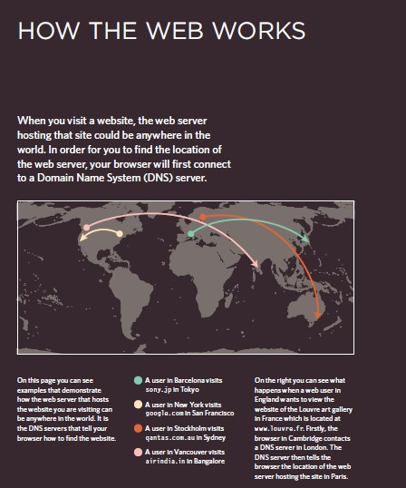
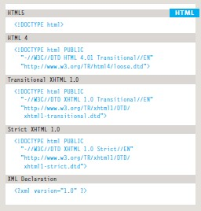
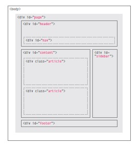
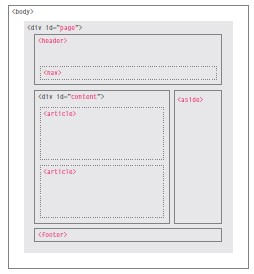
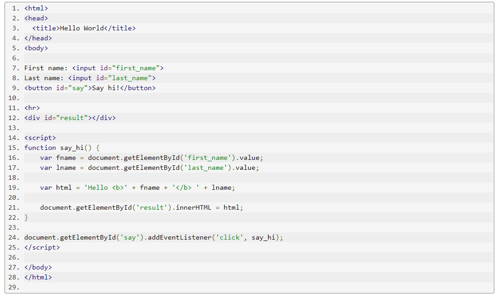

# **A brief intro to HTML and JS.**

## What is Html and CSS?

| HTML                                    |                              CSS                                         |
|-----------------------------------------|--------------------------------------------------------------------------|
HTML stands for Hyper Text Markup Language|                  CSS stands for Cascading Style Sheets                   |
HTML is the standard markup language for  |
creating Web pages                        | CSS describes how HTML elements are to be displayed on screen, paper,                                                                    or in other media                             |
HTML describes the structure of a Web page| CSS saves a lot of work. It can control the layout of multiple web pages all |at once                                   |
HTML consists of a series of elements     |                  External stylesheets are stored in CSS files            |

HTML elements tell the browser how to     |
display the content                       |                                                                          |

HTML elements label pieces of content such|                                                                          |
as "this is a heading", "this is a        |                                                                          |
paragraph", "this is a link", etc         |                                                                          |
      


## How can you access the internet?

> Browser
   
   People access websites using software called a web browser. Popular examples include  _Firefox, Internet Explorer, Safari, Chrome, and Opera_. In order to view a web page, users might type a web address into their browser, follow a link from another site, or use a bookmark.

> Web Servers
    When you ask your browser for a web page, the request is sent across the Internet to a special computer known as a web
server which hosts the website.

> Screen readers
    Screen readers are programs that read out the contents of a computer screen to a user. They are commonly used by people
with visual impairments.

***

_Small sites_ use HTML and CSS

_Large Sites_ also use data bases to store info eg: PHP, ASP.nt, Java, Ruby. (however these **do not** influence what the user sees!)





***

## Structures.

-    Helps tell the story, uses headings and sub headings.

-    Html uses elements to do this.
    
    - elements further use tags who act as containers.

-    Attributes tell us more about the elements and are present in the opeaning tag.

    - they are made up of two words i.e. **name and value**


```
 
<html>
    <body>
        <h1>This is the Main Heading</h1>
        <p>This text might be an introduction to the rest of
        the page. And if the page is a long one it might
        be split up into several sub-headings.<p>
        <h2>This is a Sub-Heading</h2>
        <p>Many long articles have sub-headings so to help
        you follow the structure of what is being written.
        There may even be sub-sub-headings (or lower-level
        headings).</p>
        <h2>Another Sub-Heading</h2>
        <p>Here you can see another sub-heading.</p>
    </body>
</html>

```

## Extra Mark-up.

### Evolution of html

Because there have been several versions of HTML, each web page should begin with a DOCTYPE declaration to tell a browser which version of HTML the page is using (although browsers usually display the page even if it is not included).



## Comments.

If you want to add a comment to your code that will not be visible in the user's browser, you can add the text between these characters:
``` <!-- comment goes here --> ```.

## ID.

` <p id="pullquote"> `

Every HTML element can carry the id attribute. It is used to uniquely identify that element from other elements on the
page. Its value should start with a letter or an underscore (not a number or any other character). It is important that no two elements on the same page have the same value for their id attributes (otherwise the value is no longer unique).

## Class.

` <p class="important"> `
Every HTML element can also carry a class attribute.Sometimes, rather than uniquely
identifying one element within a document, you will want a way to identify several elements as being different from the other elements on the page.

## Html layout.

Traditional HTML Layouts.


New Html Layouts.



***


## What is Javascript?

JavaScript ([JS](https://developer.mozilla.org/en-US/docs/Web/JavaScript)) is a lightweight, interpreted, or just-in-time compiled programming language with first-class functions. While it is most well-known as the scripting language for Web pages, many non-browser environments also use it, such as Node.js, Apache CouchDB and Adobe Acrobat. JavaScript is a prototype-based, multi-paradigm, single-threaded, dynamic language, supporting object-oriented, imperative, and declarative (e.g. functional programming) styles. 

## How does JS fit into the web structure?

* HTML  is the markup language that we use to structure and give meaning to our web content, for example defining paragraphs, headings, and data tables, or embedding images and videos in the page.

* CSS  is a language of style rules that we use to apply styling to our HTML content, for example setting background colors and fonts, and laying out our content in multiple columns.

* JavaScript  is a scripting language that enables you to create dynamically updating content, control multimedia, animate images, and pretty much everything else. (Okay, not everything, but it is amazing what you can achieve with a few lines of JavaScript code.)


## So what can it really do?

The core client-side JavaScript language consists of some common programming features that allow you to do things like:

* Store useful values inside variables. In the above example for instance, we ask for a new name to be entered then store that name in a variable called name.

* Operations on pieces of text (known as "strings" in programming). In the above example we take the string "Player 1: " and join it to the name variable to create the complete text label, e.g. ''Player 1: Chris".

* Running code in response to certain events occurring on a web page. We used a click event in our example above to detect when the button is clicked and then run the code that updates the text label.
And much more!

## What are API's

Browser APIs are built into your web browser, and are able to expose data from the surrounding computer environment, or do useful complex things. For example:

* The DOM (Document Object Model) API allows you to manipulate HTML and CSS, creating, removing and changing HTML, dynamically applying new styles to your page, etc. Every time you see a popup window appear on a page, or some new content displayed (as we saw above in our simple demo) for example, that's the DOM in action.

* The Geolocation API retrieves geographical information. This is how Google Maps is able to find your location and plot it on a map.

* The Canvas and WebGL APIs allow you to create animated 2D and 3D graphics. People are doing some amazing things using these web technologies 

* Audio and Video APIs like HTMLMediaElement and WebRTC allow you to do really interesting things with multimedia, such as play audio and video right in a web page, or grab video from your web camera and display it on someone else's computer 

## Tools & resources

[JS shells](https://developer.mozilla.org/en-US/docs/Web/JavaScript/Shells)

[Run JS](https://runjs.app/)

***

## Input Output in plain JavaScript




***

[**Home**](https://rushabhjsoni.github.io/reading-notes/)
