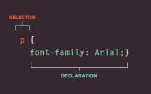
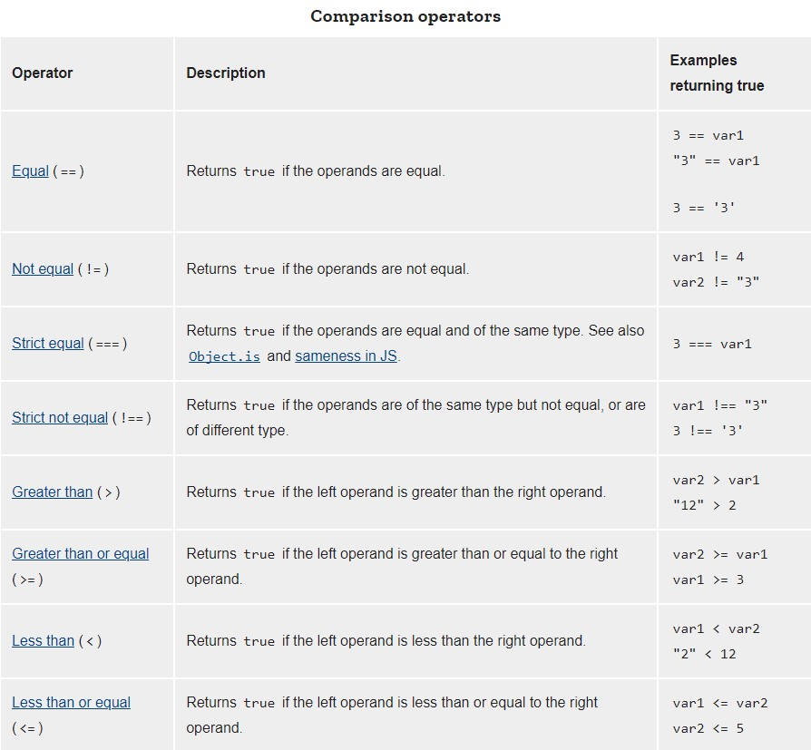

## Text

HTML has six "levels" of headings:

```
<h1> Largest 
<h2>
<h3>
<h4>  To
<h5>
<h6> Smallest

```
- Paragraph <p>
To create a paragraph, surround
the words that make up the
paragraph with an opening `<p>`
tag and closing `</p>` tag.
By default, a browser will show
each paragraph on a new line
with some space between it and
any subsequent paragraphs.

- **Bold** & _Italic_ ------------      `<b>` , `<i>`

- **White Space**
       In order to make code easier to
read, web page authors often
add extra spaces or start some
elements on new lines.
When the browser comes across
two or more spaces next to each
other, it only displays one space.
Similarly if it comes across a line
break, it treats that as a single
space too. This is known as
white space collapsing.

- Line Breaks & Horizontal Rules------ `<br />` , `<hr />`

## Semantic Markup

There are some text elements that are not intended to affect the
structure of your web pages, but they do add extra information to the
pages

Strong & Emphasis ------------- `<strong>` , `<em>`

Quotations ------------`<blockquote>`, `<q>`

***
## CSS.

CSS allows you to create rules that control the
way that each individual box (and the contents
of that box) is presented.

CSS code can be written in 3 ways:

  - Inline
  - Internal
  - External

### Basic CSS declaration

  


***


## Basic JavaScript Instructions.

A script is a series of instructions that a computer can follow one-by-one. Each individual instruction or step is known as a statement. Statements should end with a semicolon.


- MULTI-LINE COMMENTS
To write a comment that stretches over more than
one line, you use a multi-line comment, starting with
the /* characters and ending with the * /

- SINGLE-LINE COMMENTS
In a single-line comment, anything that follows the
two forward slash characters I/ on that line will not
be processed by the JavaScript interpreter


## Decisions and Loops.

Decision Making statements are if, else, elseif and switch these statements are used in making decisions.


if..else statements is used where you want to execute a set of code when a condition is true and another if the condition is not true

eg: 

``` if (condition)
{
  code to be executed if condition is true
}
else
{
  code to be executed if condition is false
} ```

elseif statements
elseif statements is used where you want to execute a some code if one of several conditions are true use the elseif statement

eg:

``` if (condition)
{
  code to be executed if condition is true
}
elseif (condition)
{
  code to be executed if condition is true;
}
else
{
  code to be executed if condition is false
}
```
### Comparison operators

A comparison operator compares its operands and returns a logical value based on whether the comparison is true. The operands can be numerical, string, logical, or object values.




***

## Loops

Loops offer a quick and easy way to do something repeatedly.

### For Loop

A for loop repeats until a specified condition evaluates to false. 

consists of 3 parts:

``` for ([initialExpression]; [conditionExpression]; [incrementExpression]) ```

### While loop

A while statement executes its statements as long as a specified condition evaluates to true. 


***

## Loop Quiz!

> Quizz.com

1. Which of these is not a type of loop in JavaScript?

- while

- for

- repeat

2. Which of these expressions is NOT a valid way to add 1 to a variable in JavaScript?

- x++

- x += 1

- x = x + 1

- x+

3. Let's say you have an x variable that starts as 0. If you want your while loop to stop once the x variable equals 400, what condition would you use?

- x < 400

- x > 400

- x == 400

- x >= 400

***


[**Home**](https://rushabhjsoni.github.io/reading-notes/)