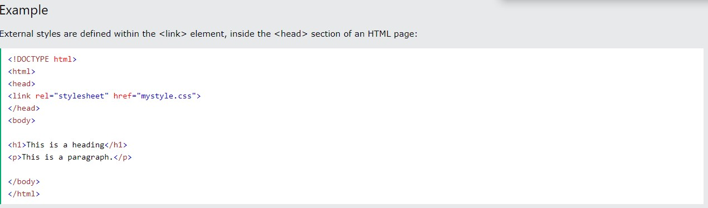
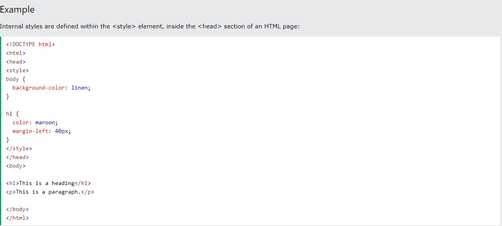
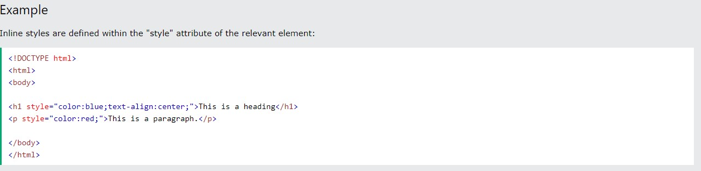
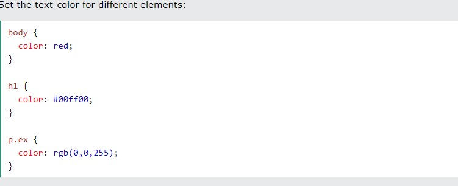

# Intro to CSS

## What is CSS?

CSS ([Cascading Style Sheets](https://developer.mozilla.org/en-US/docs/Learn/CSS/First_steps/What_is_CSS)) allows you to create great-looking web pages, but how does it work under the hood?

## How to add CSS

Here are a few examples.

``` 
h1 {
    color: red;
    font-size: 5em;
}

```

 The rule opens with a selector . This selects the HTML element that we are going to style. In this case we are styling level one headings (` <h1> `).We then have a set of curly braces { }. Inside those will be one or more declarations, which take the form of property and value pairs. 
 
 Before the colon, we have the property, and after the colon, the value. CSS properties have different allowable values, depending on which property is being specified. In our example, we have the color property, which can take various color values. We also have the font-size property. This property can take various size units as a value.

- Three Ways to Insert CSS  
  - External CSS
  - Internal CSS
  - Inline CSS
    
* External CSS

    


* Internal CSS
        


* Inline CSS 

    


## CSS color Property

The color property specifies the color of text.

Tip: Use a background color combined with a text color that makes the text easy to read.

eg: 

***

## CSS reference

Use this CSS reference to browse an alphabetical index of all of the standard CSS properties, pseudo-classes, pseudo-elements, data types, functional notations and at-rules. You can also browse key CSS concepts and a list of selectors organized by type. Also included is a brief DOM-CSS / CSSOM reference.

[Click here for more!](https://developer.mozilla.org/en-US/docs/Web/CSS/Reference)


* [Myers Web Reset Stylesheet](https://meyerweb.com/eric/tools/css/reset/)

***

[**Home**](https://rushabhjsoni.github.io/reading-notes/)