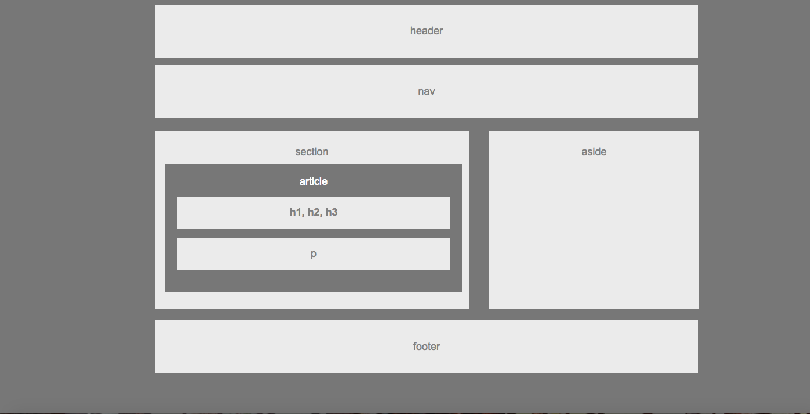

# HTML a begining.

## What are wire frames?

    Html essentially consists of boxes and wire frames are used to used to build these boxes/containers within each other to form the basic structure of a web page.
    

## Considerations for creating a wire frame.

In the bullet points below are a number of ways different designers can structure the process from design to implementation:

* Wireframe > Interactive Prototype > Visual > Design
* Sketch > Code
* Sketch > Wireframe > Hi-Def Wireframe > Visual > Code
* Sketch > Wireframe > Visual > Code

## Download your top tools for wire framing from here!

> 1. [UXPin](https://www.uxpin.com/): UXPin has a wide range of functionalities, but one of the best ones is how it facilitates building responsive clickable prototypes directly in your browser.

> 2. [Wireframe.cc](https://wireframe.cc/): Wireframe.cc provides you with the technology to create wireframes really quickly within your browser, the online version of pen and paper.

## How to make your Wireframe Good: 3 Key Principles!

1. Clarity
2. Confidence
3. Simplicity is key

***

## HTML basics

**HTML** ([Hypertext Markup Language](https://developer.mozilla.org/en-US/docs/Learn/Getting_started_with_the_web/HTML_basics)) is the code that is used to structure a web page and its content. For example, content could be structured within a set of paragraphs, a list of bulleted points, or using images and data tables.

HTML consists of a series of elements, which you use to enclose, or wrap, different parts of the content to make it appear a certain way, or act a certain way. The enclosing tags can make a word or image hyperlink to somewhere else, can italicize words, can make the font bigger or smaller, and so on. 

## Anatomy of an HTML element

### The main parts of our element are as follows:

- The opening tag: This consists of the name of the element (in this case, p), wrapped in opening and closing angle brackets. This states where the element begins or starts to take effect — in this case where the paragraph begins.

- The closing tag: This is the same as the opening tag, except that it includes a forward slash before the element name. This states where the element ends — in this case where the paragraph ends. Failing to add a closing tag is one of the standard beginner errors and can lead to strange results.

- The content: This is the content of the element, which in this case, is just text.

- The element: The opening tag, the closing tag, and the content together comprise the element.

***

## Semantics in HTML

Semantics refers to the meaning of a piece of code — for example "what effect does running that line of code

 > for example, the <h1> element is a semantic element, which gives the text it wraps around the role (or meaning) of "a top level heading on your page."

 ***

[**Home**](https://rushabhjsoni.github.io/reading-notes/)