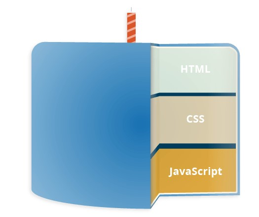

# Java Script!

## What is Javascript?

JavaScript ([JS](https://developer.mozilla.org/en-US/docs/Web/JavaScript)) is a lightweight, interpreted, or just-in-time compiled programming language with first-class functions. While it is most well-known as the scripting language for Web pages, many non-browser environments also use it, such as Node.js, Apache CouchDB and Adobe Acrobat. JavaScript is a prototype-based, multi-paradigm, single-threaded, dynamic language, supporting object-oriented, imperative, and declarative (e.g. functional programming) styles. 

## How does JS fit into the web structure?

* HTML  is the markup language that we use to structure and give meaning to our web content, for example defining paragraphs, headings, and data tables, or embedding images and videos in the page.

* CSS  is a language of style rules that we use to apply styling to our HTML content, for example setting background colors and fonts, and laying out our content in multiple columns.

* JavaScript  is a scripting language that enables you to create dynamically updating content, control multimedia, animate images, and pretty much everything else. (Okay, not everything, but it is amazing what you can achieve with a few lines of JavaScript code.)

## So what can it really do?

The core client-side JavaScript language consists of some common programming features that allow you to do things like:

* Store useful values inside variables. In the above example for instance, we ask for a new name to be entered then store that name in a variable called name.

* Operations on pieces of text (known as "strings" in programming). In the above example we take the string "Player 1: " and join it to the name variable to create the complete text label, e.g. ''Player 1: Chris".

* Running code in response to certain events occurring on a web page. We used a click event in our example above to detect when the button is clicked and then run the code that updates the text label.
And much more!

## What are API's

Browser APIs are built into your web browser, and are able to expose data from the surrounding computer environment, or do useful complex things. For example:

* The DOM (Document Object Model) API allows you to manipulate HTML and CSS, creating, removing and changing HTML, dynamically applying new styles to your page, etc. Every time you see a popup window appear on a page, or some new content displayed (as we saw above in our simple demo) for example, that's the DOM in action.

* The Geolocation API retrieves geographical information. This is how Google Maps is able to find your location and plot it on a map.

* The Canvas and WebGL APIs allow you to create animated 2D and 3D graphics. People are doing some amazing things using these web technologies 

* Audio and Video APIs like HTMLMediaElement and WebRTC allow you to do really interesting things with multimedia, such as play audio and video right in a web page, or grab video from your web camera and display it on someone else's computer 

## Tools & resources

[JS shells](https://developer.mozilla.org/en-US/docs/Web/JavaScript/Shells)

[Run JS](https://runjs.app/)

***

 [**Home**](https://slayerr1.github.io/reading-notes/)