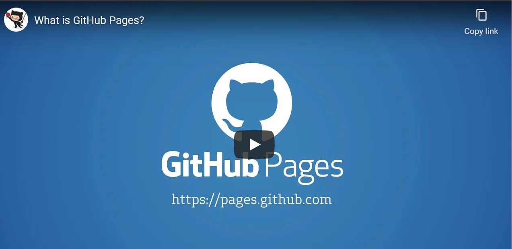

# Notes for _28 June 2021_

***

## What is Markdown Language?  

>[wikipedia:](https://en.wikipedia.org/wiki/Markdown) 

Markdown is a lightweight markup language for creating formatted text using a plain-text editor.  

Markdown is widely used in blogging, instant messaging, online forums, collaborative software, documentation pages, and readme files. Primarily used **to make static webpages**.
The language has very simple syntax and is very easy to learn even for a complete novice. 

Here are some Basic examples!

| Desired Text                      | Markdown code        |
| ----------------------------------|----------------------|
| Heading with largest font         | # Heading level 1    |
| Heading with one size smaller font| ## Heading level 2   |

The code is as simple as that! If you feel this is something you would like to learn here is a [link](https://www.markdownguide.org/basic-syntax/) for basic syntax. 

***

## Git Hub

GitHub is a Git repository hosting service, but it adds many of its own features. While Git is a command line tool, GitHub provides a Web-based graphical interface. 

We learnt how to register with git hub and the advantages of using git hub. I will let you watch the following video to learn more about the same!

